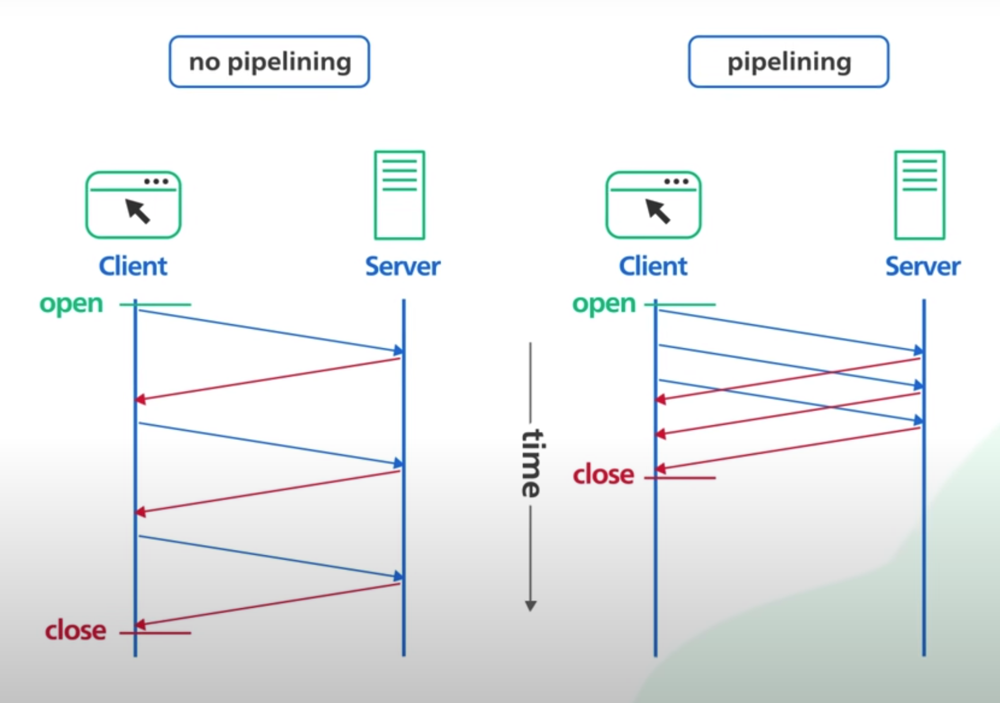

# Http versions :-
- `(http_1) --> (http_1.1) --> (http_2) --> (http_3)`.

1. ***`Http 1`*** :
- Introduced in 1996.
- Every request to the same server requires a seperate TCP connection.
- 

2. ***`Http 1.1`*** :
- Introduced in 1997.
- It introduced an keep alive mechanism so that 1 TCP connectcan be used for more than 1 http request. This is called as `Persistent connection`.
- 

- It reduced request latency, as the client does not need to initiate expensive TCP 3-way handshake for every request.
- It also introduced the `Http Pipelining`. This allows the client to send multiple requests before waiting for each response. the response must be received in the same order as to requests. It was tricky to implement correctly and many proxy servers in b/w did not handle the pipelining properly. It's support was eventually removed from many web browsers.
- 

- It suffers from an issue called as `Head-of-line blocking` :
    - It says subsequest request on the same connection must wait for the previous requests to complete.
    - If a request is blocked for any reason like packet loss, all subsequent requests on the same connection are also impacted.
    - 

- To keep loading performance at an acceptable level, browsers kepp multiple TCP connections to the same server and send requests to it in parallel.
- 

3. ***`Http 2`*** :
- Published in 2015.
- It introduces `STREAMS`, where multiple streams of requests can be sent to the same server on a single TCP connection.
- Each stream is independent of each other.
- Also it does not need to be sent or received in order.
- 

- It solves the head-of-line issue at the appliation layer. but `Issues still exists in the transport layer with TCP`.
- Http/2 introduced a `Push Capability`.
    - This allows servers to send updates to the clients whenever new data is available, without requiring a client to poll.
    - 

4. ***`Http 3`*** :
- Recently published in June 2022.
- It uses a new protocol called `QUIC` instead of TCP as an underlying transport layer protocol.
- `QUIC is baed on UDP`.
- It introduces `STREAMS as FIRST-CLASS CITIZENS at the transport layer`.
- QUIC streams share the same quic connection so no additional handshakes are required to create new connections.
- QUIC streams are delivered independently.
- In most cases, Packet loss affecting one stream does not effect others, this how `QUIC eliminates the Head-of-line Blocking at Transport layer`.
- 

- QUIC is designed(by Google) for mobile heavy internet usage.
- Since people keep on moving from one location to another, with TCP the handoof of connection from one network to another is Sluggish.
- QUIC implements a concept called CONECTION ID.
    - This allows conections to move b/w IP addresses and network interfaces quickly and reliably.
    - 

- Backward Compatibility:
    - HTTP/3 is designed to be backward-compatible with previous versions of HTTP, allowing it to work alongside HTTP/1.1 and HTTP/2. 
    - This means that servers and clients that support HTTP/3 can still communicate with those using earlier versions of the protocol.
- Multiplexing and Stream-based: 
    - Similar to QUIC, HTTP/3 supports multiplexing, allowing multiple streams of data to be sent over a single connection. 
    - This enables concurrent and independent data transfer, improving performance.

## *** `NOTE : does HTTP/3 gives all features of TCP ??` ***
- HTTP/3, as a protocol built on top of QUIC, does not provide all the features of TCP (Transmission Control Protocol) directly. TCP is a reliable, connection-oriented protocol that ensures the ordered and error-free delivery of data packets.

- `QUIC`, on the other hand, is a `transport protocol` designed to improve the performance of web communication. It uses UDP (User Datagram Protocol) as the underlying transport protocol and `incorporates its own reliability and congestion control mechanisms`.

- While QUIC provides reliability features similar to TCP, such as error correction and loss recovery, it is not a drop-in replacement for TCP. 
- `QUIC is optimized for low-latency communication, multiplexing, and improved congestion control`.

- It aims to address the limitations of TCP, such as head-of-line blocking and long connection establishment times.

- `HTTP/3 leverages the benefits of QUIC`, including its improved performance and reduced latency, `but it does not provide all the features of TCP directly`.

- `TCP is still used at lower layers of the network stack for reliable and ordered data delivery, while HTTP/3 focuses on providing a more efficient and secure application layer protocol`.