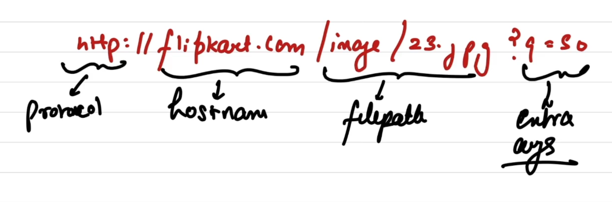
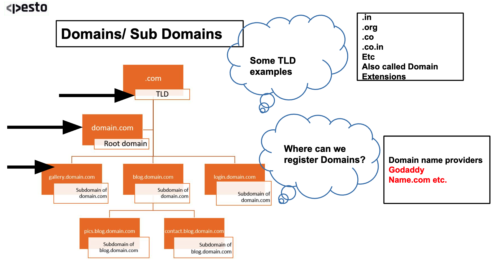

# Http (Hyper text transfer protocol) :-
- a application layer protocol.
- The rules for sending Html like data is written in http protocol.
- It defines the whole procedure on how client and server will interact.
- `Http is also categorised into request-response protocols`.
    - The 1st message is : http request.
    - The 2nd message is : http response.
- `Http is a stateless protocol (means : server does not store any info about the client.)`
    - If client sends multiple requests for same resource, it will serve with a response each time, it wont like check if it is same request so developers have to implement some logic to handle sch cheks.

## Objects :-
- webpages are the main objects that contains other objects. some other objects can be MP3 files, Png files, jpg files, etc.
- every object has a URL.

## URL (uniform resource locator) :-
- The URL has different parts.
- **`The Anatomy of a url`**
    - `url`                 - https://blog.brand.com/subdirectory/page?q=50
    - `https://`            - Protocol
    - `blog`                - sub-domain.  eg:- {calendar.google.com | mail.google.com | drive.google.com | etc.}
    - `.brand`              - Second level domain      
    - `.com`                - Top level domain.         eg:- {.in | .org | .Ai | etc.}
    - `brand.com`           - Domain name/Host name
    - `/subdirectory/page`  - location of file/object.
    - `?q=50`               - arguments.
    
    

***Note : A lot of application layer protocols depend on lower level protocols of transport layer.***
- In transport layer there are 2 main protocols :-
    1. TCP
    2. UDP
- Http connection depends on TCP : 
    - that means in order to establish a HTTP connection we 1st need to establish a TCP connection.

# There are 2 types of HTTP connection :-
1. `Persistent http` :
    - here once we setup a connection, we can send and receive requests/response as many times without settiing up a new new connection everytime.
    - eg :- in chat apps. ( Web-Sockets are a big example of such things. )
2. `Non-persistent http` :
    - here we setup a new connection every time for a request/response cycle.
    - once we receive a response the connection breaks.

# Http request & response messages :-
1. `Http request message` :-
    - Any http message are plain ASCII text.
    - `Http request Header :`
        - This is some extra piece of information that is sometimes used for the request message but it is not necessary to include it in the message. eg :- the JWT token we send to authenticate the user is part of the request header.
        - This header we don't include it in the request message object as it just pollutes the message and it is usually the convention to send it as a seperate header object.
        - ***`user-agent : It specifies the client. It is useful when the server has different web pages / resources that exists for different device types. eg ;- for Macbook we have completely different web page(not just by responsiveness but by content as well) and for Iphone completely different page, then the user-agent field comes in use.`***
        - ***`Accept-language : It specifies the preffered language.`***
        - ***`Connection : for non-persistent http connection = closed, for persistent http connection = open.`***
2. `Http response message` :-
- http response status codes :
    1. `Informational responses` (100 – 199)
    2. `Successful responses` (200 – 299)
    3. `Redirection messages` (300 – 399)
    4. `Client error responses` (400 – 499)
    5. `Server error responses` (500 – 599)

# Http request methods / Http verbs :-
- Each of the methods implements a different semantic. 
- Although if we try we can do tasks of GET using POST as well but that is not semantically correct and will become hard for anyone to understand and read the code later.

1. ***`GET`***
    - The GET method requests a representation of the specified resource. Requests using GET should only retrieve data.

2. ***`POST`***
    - The POST method submits an entity to the specified resource, often causing a change in state or side effects on the server.

3. ***`PUT`***
    - The PUT method replaces all current representations of the target resource with the request payload.

4. ***`PATCH`***
    - The PATCH method applies partial modifications to a resource.

5. ***`DELETE`***
    - The DELETE method deletes the specified resource.

6. ***`HEAD`***
    - The HEAD method asks for a response identical to a GET request, but without the response body.

7. ***`OPTIONS`***
    - The OPTIONS method describes the communication options for the target resource.

8. ***`TRACE`***
    - The TRACE method performs a message loop-back test along the path to the target resource.

9. ***`CONNECT`***
    - The CONNECT method establishes a tunnel to the server identified by the target resource.

