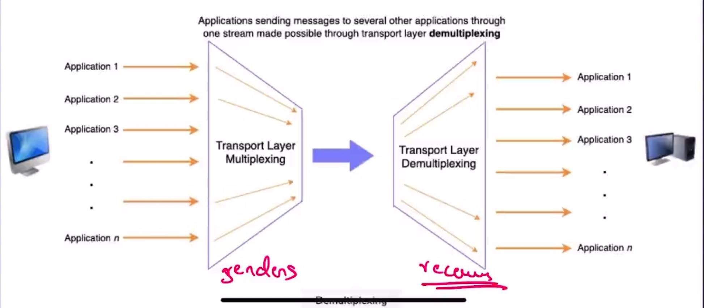
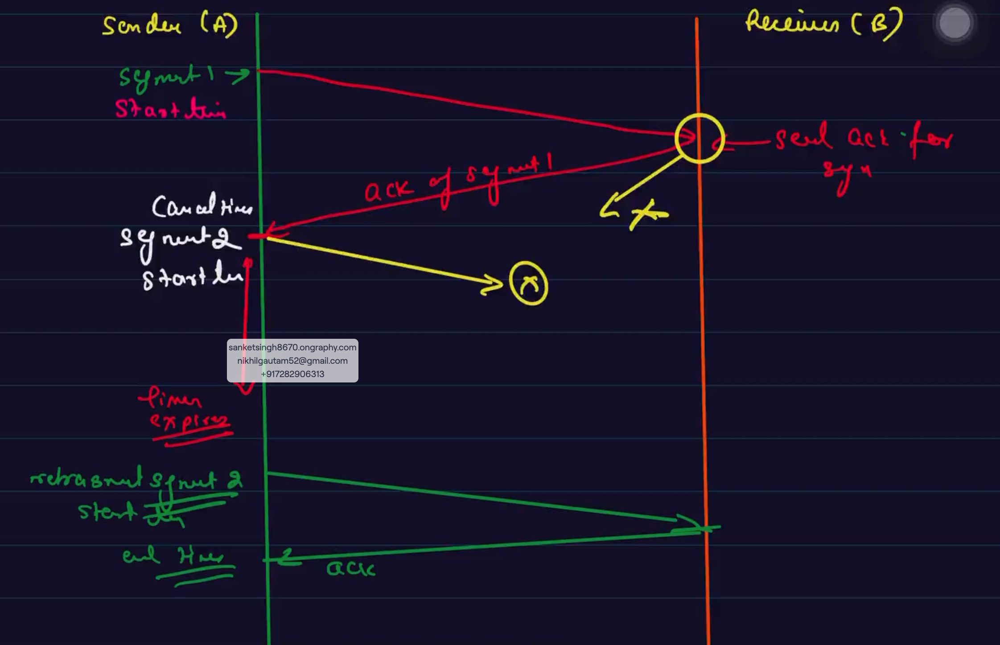
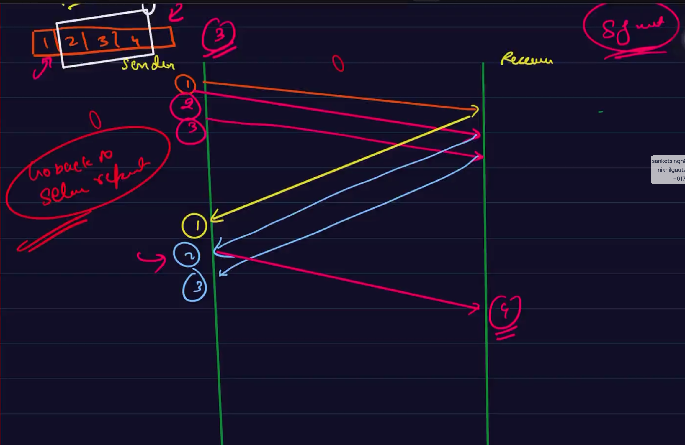

# Transport Layer :-
- 2 protocols `{1. TCP, 2. UDP}`.
- It plays a very important role in establishing a communication b/w the Application layer and the Network layer.
- `The transport layer and its protocols resides on the end system.` 
- The key responsibility is to extend the Network layer to the Application layer.
## Responsibilities of Transport Layer :-
1. `Segment Data` :
    - Transport layer divides the data given by the application layer into small pieces called ***`"SEGMENTS"`(in TCP) and `"DATAGRAMS"`(in UDP)***.
    - It adds an extra header to these pieces.
2. `Can allow multiple conversations` :
    - Conversation b/w multiple application can happen.
    - It tracks each application to application connection or conversation separately. This allows multiple conversation to occur simultaneously.
3. `Multiplexing Data` :
    - From 1 host --> It gathers data from multiple applications.
    - adds extra header to each data packet.
    - finally sends it as a whole to the intended receiver.
    - It allows message to be sent to more that one destination host via single medium.
4. `Demultiplexing Data` :
    - Delivering received segments at the receivers side to the correct application layer processes is called demultiplexing.
    - 

5. `Reliable Data Transfer (using TCP)` :
    - There are a lot of network layer imperfections that transport layer is supposed to deal with like;
        - Segments can be corrupted.
        - Segments can be lost.
        - Segments can be reordered or duplicated.

## Reliable Data Transfer (using TCP) :-
1. `Checksum` :
    - The first imperfectiopn is that data segments may be corrupted by transmission segments.
    - checksum is an error detection mechanism.
    - Checksum(arithmetic sum) is attached with the segments which is then verified by the receiver.
2. `Retranmission Timers` :
    - The second imperfection is that the segments will be last.
    - To resolve this retransmission timers are used.
    - These are timers that start when a mesage is sent and the TIMEOUT happens after certain time.
    - `The retransmission time should be greater than the round trip time( time taken by data to reach from sender to receiver + time taken for acknowledgement to reach from receiver to sender).`
    - If the timer times out then we can say that sender was not able to send the data to receiver thats why we didn't receive any acknowledgement till now.
    - `LIMITATION` :
        - If suppose sender has sent the data and the reciver's acknowledgement failed to reach the sender then still the sender will resend the same segment of data.
        - This creates Duplication and hence is a limitation of retransmission timers.
    - 

3. `Sequence Numbers` :
    - This is an identification number attached with each segment to identify duplicates.
4. `Sliding window protocol` :
    - It is used to avoid overload on the receivers end.
    - The sender and receiver agrees on a window size.
    - Thse are set of consecutive numbers that the sender uses in transmitting to ensure waitless data transfer.
    - 
    - There can happen that some packet was lost so there are 2 types of sliding window techniques used to ivercome such issues;
        1. `Go-Back-N ARQ`
        2. `Selective Repeat ARQ`