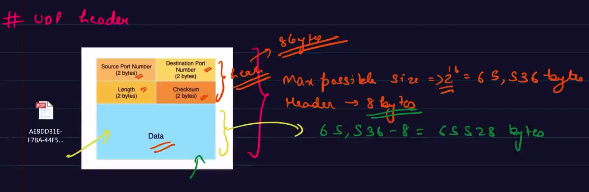

# UDP (User datagram protocol) :-
- It is a Transport layer protocol.
- It is used by apps that don't need guaranteed delivery service of TCP. Either bcz application handles it on its own or it just don't need reliable delivery.
- Much simpler than TCP.
- It takes the data, converts it into UDP datagram and sends it into the network layer.

## UDP Header :-
- 

## why UDP ?
- Faster.
- Reliability can be built seperately.
- Small header size gives an edge in terms of `reduced transmission overhead` and `quicker transmission time`.

## Application :-
- `UDP is well-suited for real-time applications such as video streaming, online gaming, and voice-over-IP (VoIP) services`.
- Netflix :
    - Netflix uses the User Datagram Protocol (UDP) for streaming its content.
    - Netflix utilizes UDP for its video streaming service because UDP offers lower latency and faster transmission compared to other protocols like Transmission Control Protocol (TCP). 
    - UDP does not have the built-in reliability and error correction mechanisms of TCP, but for streaming purposes, where a small amount of packet loss can be tolerated, UDP's speed and lower overhead make it a suitable choice.
    - To compensate for the lack of reliability in UDP, Netflix implements its own error correction and congestion control mechanisms at the application layer. 
    - These mechanisms help ensure smooth playback and minimize disruptions caused by packet loss or network congestion.
    - It's worth noting that while Netflix primarily uses UDP for streaming, other protocols like TCP may be used for other non-real-time communications, such as client-server interactions, data synchronization, and control signals.
- Xbox.
- Name translation of DNS.