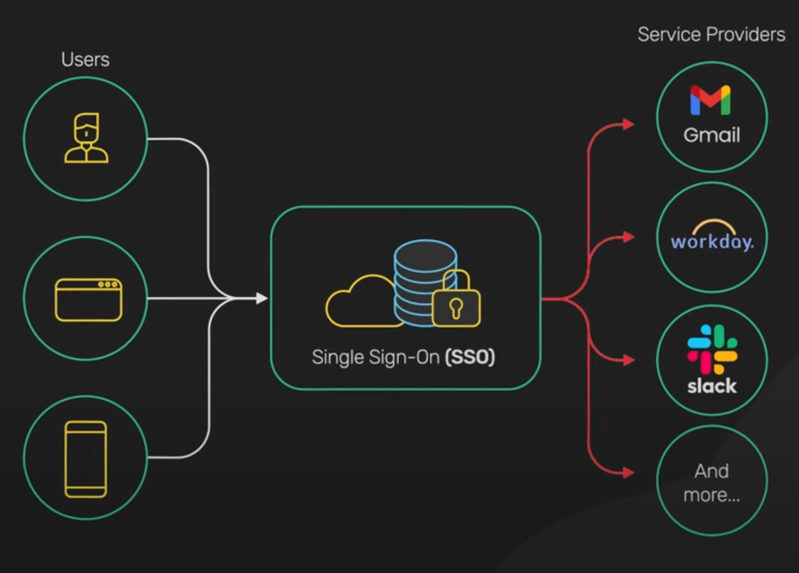
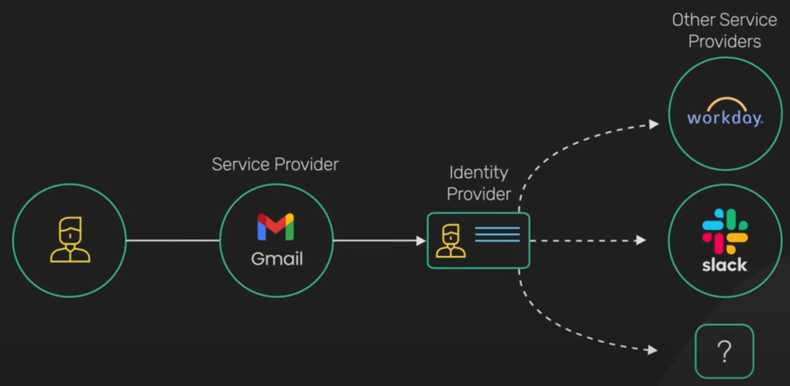
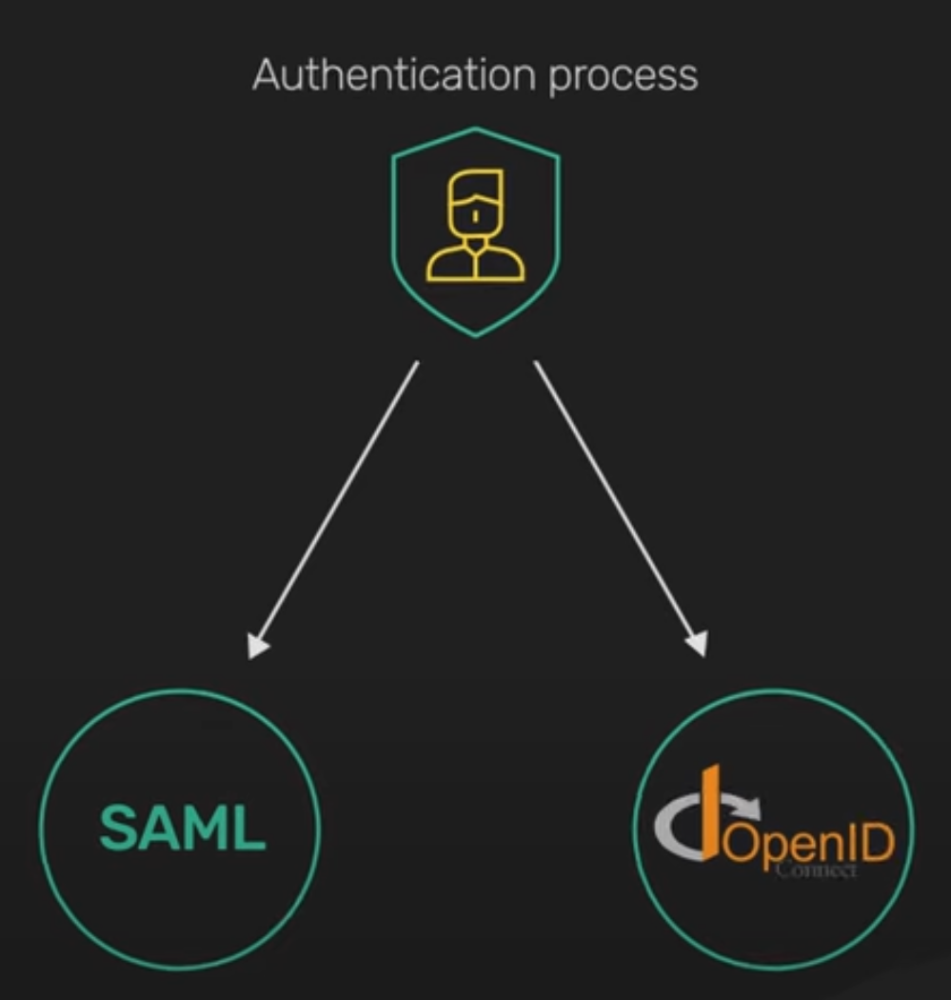
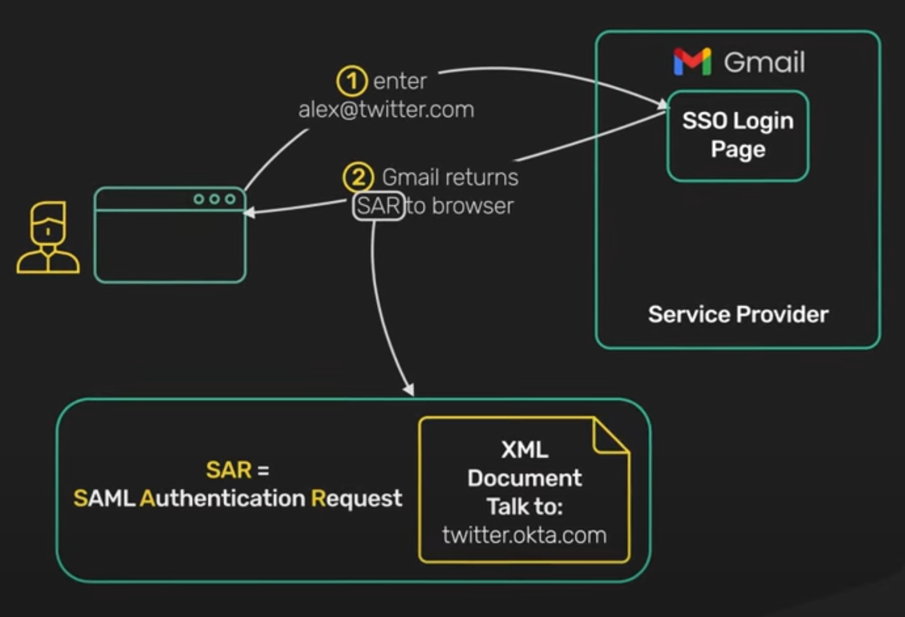
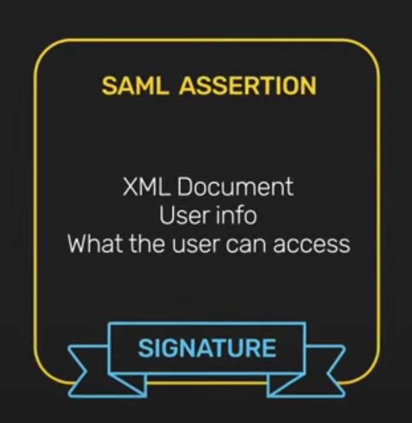
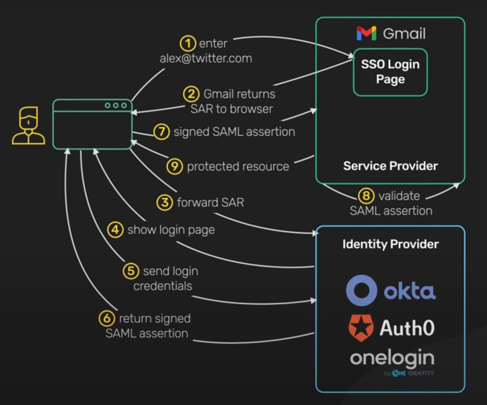
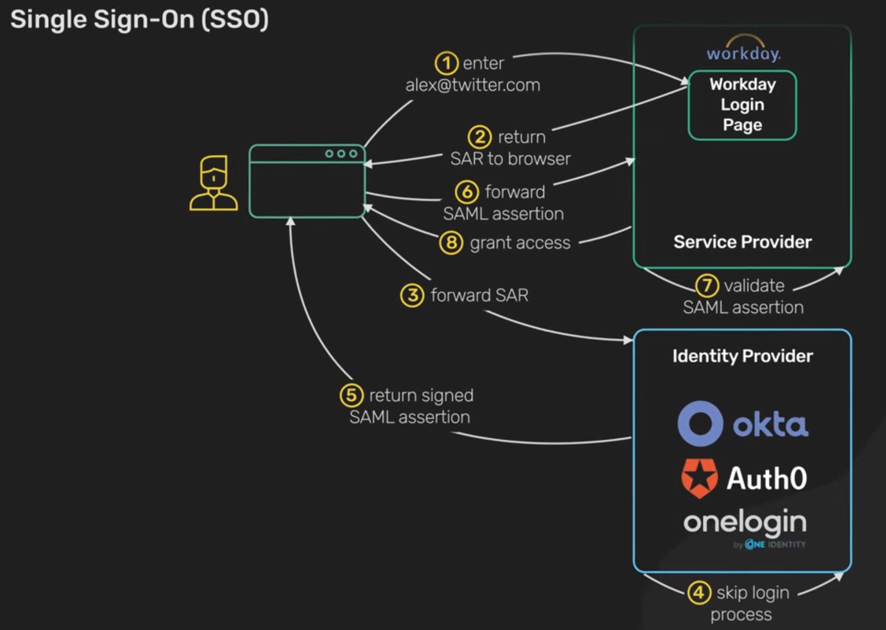

# SSO (Single Sign-On) :-
- It is an authentication scheme that enables the user to access multiple applications and services using a Single ID.
- With SSO user can access many apps w/o having to login each time.
- 

- SSO is built on a concept called `Federated Identity`.
- It enables sharing of identity info accross trusted but independent systems.
- 

- There are 2 common protocols for this authentication process.
    1. `SAML (Security Assertion Markup Language)` :
        - XML based open standard for exchanging Identity information b/w services.
    2. `OpenId` :
        - It uses JWT or JSON web token to share identity information b/w services.
    - 

## How it works :-
- A user(office worker) visits an application like Gmail(Service Provider).
- The Gmail server detects that the user is from a work domain. It returns a `SAR (SAML authentication request)` back to the browser.
- 

- The browser redirects the user to the identity provider for the company specified in the SAML authentication request(or SAR) (eg:- Okta, Auth0, oneLogin, etc).
- The Identity Provider shows the login page where the user enters the login credentials.
- Once the user is authenticated, the Identity Provider generates a SAML response and returns that to the browser.
- This is called a `SAML Assertion`.
- The SAML Assertion is a cryptographically signed XML document that contains information about the user and what the user can access with the service provider.
- 

- The browser forwards the signed SAML Assertion to the service provider.
- The service provider validates that the assertion was signed by the Identity Provider. This validation is usually done with the `public key cryptography`.
- The service provider finally returns the protected resource to the browser based on what the user is allowed to access as specified in the SAML Assertion.
- 

## What happens when the user navigates to another SSO integrated application (like WorkDay):-
- The workday will also detect the work domain and return the SAML authentication request back to the browser.
- The browser again redirects the user to the Identity Provider.
- Since the user has already logged in with the identity provider, It skips the login process.
- Instead, it generates a SAML Assertion that contains information about the user and what the user can access with the service provider.
- The SAML assertion is returned to the browser and forwarded to workday.
- Workday validates the signed assertion and grants the user access accordingly.
- 