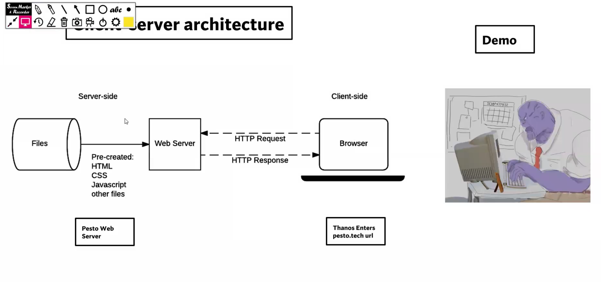

# Web Fundamentals :
## How Website works :-
- **`Why do we need a website ??`**
    -  "If a picture is worth a thousand words, then a website is worth a million."

- **`The Anatomy of a url`**
    - `url`      - https://blog.brand.com/subdirectory/page
    - `https://` - Protocol
    - `blog`     - sub-domain.  eg:- {calendar.google.com | mail.google.com | drive.google.com | etc.}
    - `.brand`   - Second level domain      
    - `.com`     - Top level domain.         eg:- {.in | .org | .Ai | etc.}
    - `brand.com`- Domain name.

    

- **`What happens when a URL is entered in browser`**?
    - eg : entering `pesto.tech`.
    - `web browser` makes a `get` request to `pesto's - web server`.
    - there is a `client-Server` interaction happening.

- **How do browsers know how to reach the `pesto web server`** ?
    - It happens through `DNS : Domain Name System` server.
    - when we enter `pesto.tech` the browser reaches to the nearest `DNS` server.
    - the `DNS` server has a mapping for the asked domain name. It does a lookup and returns a IP address back to browser.
    - eg:- `peto.tech`  :  `104.21.33.220`.
    - now web browser can directly go to that web server using the IP address.

- **How does a browser know how to go to a DNS server** ?
    - our Internet service provider has the location of nearest DNS server so the browser uses that info.
    - but we can override it as well, to look for a particular DNS server, from our system settings.
    - If we use a VPN, it will go to the VPN server first then to the DNS server.
    - ie. [browser --> VPN --> DNS].
    - If a particular DNS server does not have the mapping then it goes to another DNS server and so on.

    

## Client Server Architecture :-
- {: style = "border: 2px solid black;" }

- **If we directly hit IP address of a website instead of domain name what will happen ?**
    - It will still work, actually it will work faster as the DNS Resolver step will be skipped.

- **Having DNS server increases perfomance, yes or no ?**
    - No, it actually impacts the perfomance by a little but it makes our lives easier as to remember the IP address of every website is not feasible.

- **How communication happens between Client and Server ?** | **How will browser know just by IP address where the server is and fetch data from the server ?**
    - Client and Server uses protocols to communicate.
    
    -   |  Protocol Stack   ||||
        |---|---|---|---|
        |  Application Layer |  HTTP | TLS | DNS |
        |  Transport Layer | TCP  | UDP ||
        |  Network Layer |  IP(v4, v6) |||
        |  Link Layer / Physical Layer | Ethernet | Wireless LAN ||
    
## HTTP Request and response :-

## Servers and Hosting :-
1. Server :
    - Something that serves some data.
    - Types :-
        1. Web Server : suited for static websites.
        2. Application Server : suited for dynamic websites.
        3. Email server
        4. DNS server : A DNS (Domain Name System) server is responsible for translating domain names (e.g., www.example.com) into IP addresses. 
        5. FTP server
        6. File server
        7. Database server
        8. Proxy server
        9. Cloud server, etc.
    - Hosting companies provide these server, or we can have it ourselves as well.
2. Hosting :
    - Web Hosting refers to storing a web app(with all its related files) on a computer that is somewhere in the world and is connected to the internet. That remote computer serves the website to user when requested via internet using necessary protocols.
    - There are different types of hosting services available for websites :-
        1. `Shared hosting` : two or more app/websitess share the same resource on the server.
        2. `Cloud hosting` : it involves hosting a website on a network of interconnected servers that work together to provide high availability and scalability. 
        3. `Managed hosting` : when the technical aspect of our app/website is handled by the hosting service provider like AWS. 
        4. `Virtual private server hosting` : it involves dividing a physical server into multiple virtual servers, each of which operates as a standalone server with its own operating system and resources.
        5. `Dedicated hosting` : With dedicated hosting, a website is hosted on a single physical server that is dedicated solely to that website.

## Scaling and Autoscaling :-
- Scaling is the process of increasing the capacity of a web application to handle more traffic,
users or data.
- Two primary ways to scale our website is :-
    1. `Vertical Scaling` : incresing the CPU capacity, memory or storage etc of a single server or virtual machine.
    2. `Horizontal Scaling` : increasing the number of servers or virtual machines to distribute the traffic accross multiple servers.
***Q. If a website is deployed on a single server and is running at its peak, and the site should not be down if the traffic is increased. which scaling method is preffered ?***
- Horizontal scaling since the website cannot afford down-time.

## Site stats, popularity and SEO :-
- 